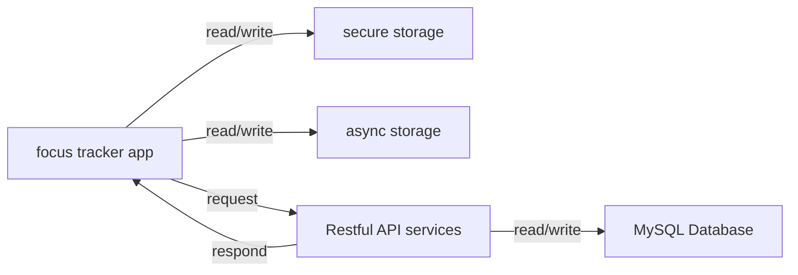

# Focus Tracker
Focus Tracker is an Application with cloud sync to record your focus time and encourage you to keep focus status.

The source code is managed through `monorepo` approach, including two components:
- client: the application for the project
- api: the server api for the project

## Features
- User login & register
- Create a focus timer
- Search and review your focus records
- Focus record synchronization
- Focus record update and deletion
- Focus record statistics by focus time and task metrics
- Dark mode support
- Global font size adjustment
- APP Configuration memorization
- Elegant Error handlement
- Secure storage for sensitive information
- Flexible configuration, e.g. API request timeout
- Full offline usability

## Application Architect


The architect of the application is as the graph above:
- the application will persist data to asyncstorage (app config and user data) and secure storage (user token), offering offline usability
- when the internet is available, the application (time tracker) will send request to the api services, and the api services perform CRUD operations to databases

## How to contribute
### Project folders
```plain
├───api
│   ├───db: database initial, schema, connection config
│   ├───docs: swagger docs
│   ├───route: api endpoints, business logic
│   ├───db.sql: the script to inital database
│   ├───app.js: the main program
│   └───util: all utils code
├───client
    └───src
        ├───components: all reusable components of the app
        ├───context: global states management
        ├───navigators: page navigation configuration
        ├───screen: the screen and layout of pages
        ├───services: local data persistency, api request and business logic
        └───util: all utils code
```

### Install Dependencies
#### Client
| Purpose | Techniques |
| --- | ------ |
| Core | [react-native](https://github.com/facebook/react-native), [EXPO](https://github.com/expo/expo) |
| Navigation | [react-navigation](https://github.com/react-navigation/react-navigation) |
| UI | [react-native-paper](https://github.com/callstack/react-native-paper), [react-native-vector-icons](https://github.com/oblador/react-native-vector-icons) |
| 3rd-party component | [react-native-paper-tabs](https://github.com/web-ridge/react-native-paper-tabs), [react-native-slider](https://github.com/callstack/react-native-slider) |
| Local data persistency | [expo-secure-store](https://github.com/expo/expo), [asyncstorage](https://github.com/react-native-async-storage/async-storage) |
| Others | [babel](https://github.com/babel/babel) |

To install all libraries you needed, please execute command below:
```bash
# make sure you are in the client folder
cd ./client 
# install all libraries
npm i
```

If you import new dependencies in client later, please use the command below to update the dependency list.

```bash
npm-license-crawler --onlyDirectDependencies --json ./assets/licenses.json
```

#### API
| Purpose | Techniques |
| --- | ------ |
| web framework | [express](https://github.com/expressjs/express) |
| live webserver | [nodemon](https://github.com/remy/nodemon/) |
| middleware | [morgan](https://github.com/expressjs/morgan), [swagger-ui-express](https://github.com/scottie1984/swagger-ui-express) |
| persistency | [mysql2](https://github.com/sidorares/node-mysql2), [drizzle-orm](https://github.com/drizzle-team/drizzle-orm) |
| others | [js-sha256](https://github.com/emn178/js-sha256), [jsonwebtoken](https://github.com/auth0/node-jsonwebtoken) |
| database | [mysql 8.0](https://dev.mysql.com/downloads/mysql/) |

```bash
# make sure you are in the api folder
cd ./api
# install all libraries
npm i
```
### Run it locally
Once you installed all needed libraries according to the instructions above, you need to perform some configuration before running the app
#### Initial your database
Once you installed the mysql database and turned it on, then you should run the command below:

```bash
cd api # go to api folder
mysql -uroot -p # login to your mysql database
source db.sql # import the database
```

#### Run the api
Then you need to create your own `.env.local` file following the `/api/.env.template`, configuring your database connection information and the api port.

```bash
cp .env.template .env.local
# make some changes in the .env.local files based on your case
npm run dev # run the api services
```

The server will run `swagger-doc` automatically, check detail in [swagger.json](./api/docs/swagger.json)

#### Running the app
Once the backend api is running, you also need to create your own `.env.local` file following the `./client/.env.template`.

```bash
cd ../client # make sure you are in the client folder
npm run start
```

Finally, the project is running

## Feedback
Please use the issue feature of GitHub. There are two template for issue report:

Bug: use it when you find anything works abnormal and know how to reproduce the issue.
Feature: use it when you want a feature that is not in this project
Please follow the template to raise your issue!
